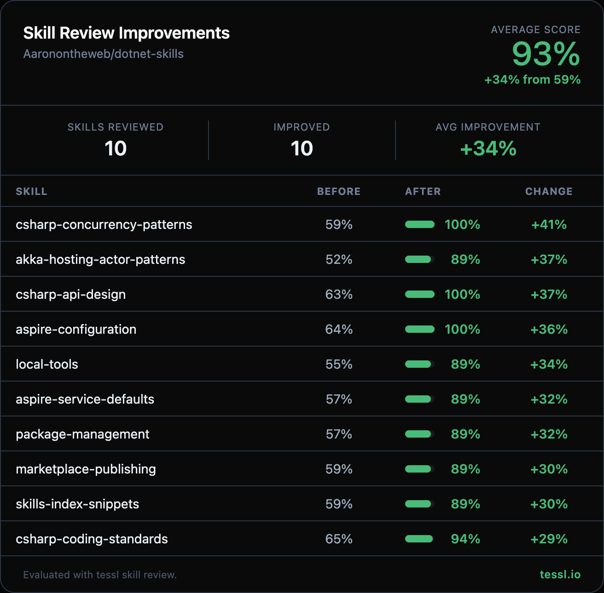

Hey 👋 @Aaronontheweb

I ran your skills through `tessl skill review` at work and found some targeted improvements. Here's the full before/after:

| Skill | Before | After | Change |
|-------|--------|-------|--------|
| csharp-concurrency-patterns | 59% | 100% | +41% |
| akka-hosting-actor-patterns | 52% | 89% | +37% |
| csharp-api-design | 63% | 100% | +37% |
| aspire-configuration | 64% | 100% | +36% |
| local-tools | 55% | 89% | +34% |
| aspire-service-defaults | 57% | 89% | +32% |
| package-management | 57% | 89% | +32% |
| marketplace-publishing | 59% | 89% | +30% |
| skills-index-snippets | 59% | 89% | +30% |
| csharp-coding-standards | 65% | 94% | +29% |
| project-structure | 60% | 89% | +29% |
| akka-best-practices | 68% | 93% | +25% |
| efcore-patterns | 64% | 89% | +25% |
| microsoft-extensions-configuration | 75% | 100% | +25% |
| serialization | 64% | 89% | +25% |
| akka-management | 69% | 93% | +24% |
| database-performance | 66% | 89% | +23% |
| opentelemetry-dotnet-instrumentation | 66% | 89% | +23% |
| playwright-blazor | 66% | 89% | +23% |
| verify-email-snapshots | 73% | 93% | +20% |
| akka-aspire-configuration | 70% | 89% | +19% |
| microsoft-extensions-dependency-injection | 76% | 93% | +17% |
| akka-testing-patterns | 70% | 86% | +16% |
| crap-analysis | 73% | 89% | +16% |
| csharp-type-design-performance | 84% | 100% | +16% |
| snapshot-testing | 73% | 89% | +16% |
| testcontainers | 78% | 93% | +15% |
| mjml-email-templates | 70% | 83% | +13% |
| aspire-mailpit-integration | 78% | 89% | +11% |
| dotnet-devcert-trust | 80% | 89% | +9% |
| playwright-ci-caching | 80% | 89% | +9% |
| slopwatch | 81% | 89% | +8% |

**Average score: 59% → 93% (+34%)**

Changes made

### Description improvements (all 32 optimized skills)
- Added "Use when..." trigger clauses to every description, giving Claude explicit guidance on when to select each skill
- Included natural user-language terms alongside technical jargon (e.g., "distributed actors" alongside "Akka.NET cluster sharding")
- Converted all description fields to quoted YAML strings for consistent frontmatter formatting

### Workflow and content improvements
- Added numbered **Workflow** sections with explicit validation checkpoints to skills that lacked step-by-step guidance
- Removed redundant "When to Use This Skill" sections (now covered by the description's "Use when..." clause)
- Trimmed explanatory text for concepts an AI agent already knows (e.g., "What is Mailpit?", "What Are Local Tools?")
- Preserved all domain-specific expertise, code examples, and reference links

### Validation fixes
- Fixed `csharp-coding-standards` description that contained XML-like tags (`Span<T>/Memory<T>`) causing validation failure
- Fixed `opentelemetry-net-instrumentation` name from `OpenTelemetry-NET-Instrumentation` to lowercase kebab-case

> **Note:** Two skills scored 0% before optimization due to validation errors (XML tags in description, uppercase in name). These were fixed first and re-scored before optimization — the "before" scores in the table reflect the corrected baselines (65% and 66% respectively), not the original 0%.

Honest disclosure — I work at @tesslio where we build tooling around skills like these. Not a pitch - just saw room for improvement and wanted to contribute.

Want to self-improve your skills? Just point your agent (Claude Code, Codex, etc.) at [this Tessl guide](https://docs.tessl.io/evaluate/optimize-a-skill-using-best-practices) and ask it to optimize your skill. Ping me - [@rohan-tessl](https://github.com/rohan-tessl) - if you hit any snags.

Thanks in advance 🙏
